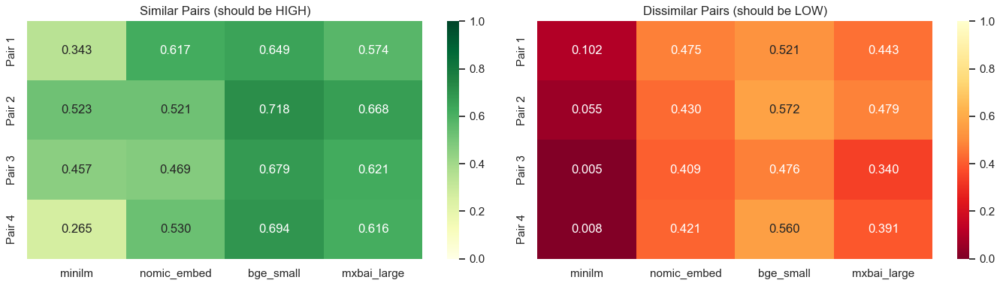
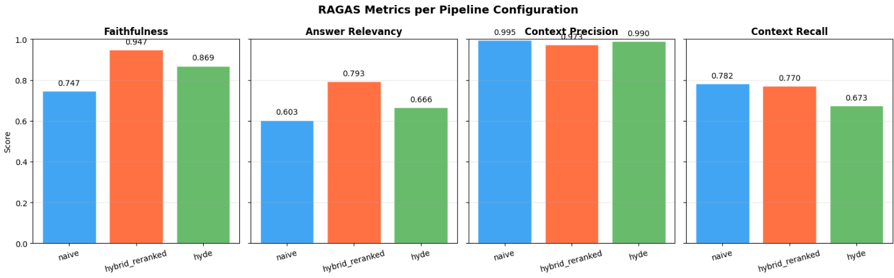

## 1. Pipeline Architecture

The project assembles a complete RAG pipeline that transforms a question into a sourced answer in four steps: split the documentation into chunks, vectorize them into a store, retrieve the most relevant ones for a query, then pass them to an LLM that generates its answer based solely on that context. Each step is isolated in a dedicated notebook, benchmarked with several alternatives, and evaluated on a standardized set of 25 questions with expert answers.

The corpus is the <a href="https://python.langchain.com/docs/" target="_blank">**LangChain Python documentation**</a> (~1,463 pages fetched from GitHub). After cleaning (removing YAML frontmatter, MDX/JSX tags, base64 blobs, normalizing whitespace) and filtering out integration pages (90% of the corpus), ~130 core documents remain, forming ~1,500 chunks.

Everything runs locally with no API calls: Mistral 7B via Ollama for generation, mxbai-embed-large for embeddings, ChromaDB for vector storage, a cross-encoder for reranking. The entire pipeline is configurable through a single YAML file:

```yaml
retrieval:
  strategy: hybrid
  dense:
    search_type: similarity
    k: 10
  sparse:
    k: 10
  hybrid:
    weights: [0.5, 0.5]
  final_k: 5

reranking:
  enabled: true
  model: cross-encoder/ms-marco-MiniLM-L-6-v2
  top_k: 5

query_translation:
  enabled: false

routing:
  enabled: false
```

Switching the retrieval strategy, enabling reranking, or swapping the embedding model requires no code changes.

## 2. Chunking and Embeddings

### a) Chunking

Five splitting strategies were compared. The recursive splitter (which splits by `\n\n`, then `\n`, then `. `, then ` `) offers the best trade-off: fast (0.24s), good MRR (0.467), and homogeneous chunk sizes (~786 chars).

A grid search over size (500–2000) and overlap (0–400) confirms that **1000/200 is the optimal point**. Beyond 200 overlap, gains are negligible.


Figure 1 - Retrieval quality heatmap by chunking parameters

### b) Embeddings

Four embedding models were evaluated. The decisive criterion is not raw MRR (not comparable across models) but **semantic separation**: the cosine similarity gap between relevant and non-relevant pairs.

| Model | Dims | Throughput (docs/s) | Semantic separation |
|---|---|---|---|
| all-MiniLM-L6-v2 | 384 | 102.3 | 0.131 |
| nomic-embed-text | 768 | 174.1 | 0.100 |
| BAAI/bge-small-en-v1.5 | 384 | 27.2 | 0.181 |
| **mxbai-embed-large** | **1024** | **72.8** | **0.207** |

mxbai-embed-large dominates with 0.207 vs 0.100 for nomic-embed-text, a **+107%** improvement in discriminating relevant documents. It is the model selected for the rest of the pipeline.



Figure 2 - Semantic separation by embedding model and by question

## 3. Retrieval Strategies

Five strategies were benchmarked. BM25 alone is insufficient for semantic queries (MRR 0.30 vs 0.60 for dense), but **combined with dense via Reciprocal Rank Fusion**, it captures both semantic matches and exact keyword matches. This is essential for technical queries containing class or function names.

MMR with lambda=0.9 is marginally better than pure similarity (MRR 0.605 vs 0.597), but forced diversity at lower lambda values degrades results. Multi-Query adds 100x latency (5s) with no improvement.


Figure 3 - Retrieval precision by question category and strategy

Conceptual questions are well handled by all strategies. Technical questions remain the most difficult across all configurations — a corpus limitation (few API reference pages survive the integration filtering).

## 4. Advanced Techniques: What Fails with a 7B Model

Several techniques designed for frontier models (GPT-4, Claude) were tested with Mistral 7B. The finding is clear: **most of them fail or degrade results**.

In **query translation**, five reformulation techniques were compared. HyDE (generate a hypothetical answer then encode it) is the only one that improves retrieval (+6.7% MRR), but at 141x the latency cost (2.7s vs 19ms). Multi-Query and Decomposition *degrade* results by -9% and -10% respectively because Mistral 7B generates imprecise or redundant variants.

In **routing**, directing queries to sub-indexes by category produces a 38% drop in MRR, even with 76% routing accuracy. The cause is a corpus imbalance: after filtering, tutorials contain 1,656 chunks versus only 1 chunk for the API reference.


Figure 4 - MRR by routing strategy and query category

In **advanced patterns** (implemented with LangGraph), three architectures were tested. **CRAG** (Corrective RAG: score each document, rewrite the query if fewer than 50% are relevant) achieves a perfect MRR of 1.000, but at 450x the latency (8s vs 18ms). **Self-RAG** is broken: Mistral 7B systematically decides that retrieval is not necessary and hallucinates. **Adaptive RAG** is also broken: the complexity classifier labels all queries as "moderate".

The pattern: CRAG works because its LLM task is simple (score yes/no). Self-RAG and Adaptive RAG require meta-reasoning beyond the reach of a 7B model. These techniques are disabled in the final pipeline.

## 5. Reranking

Reranking consists of retrieving 20 candidates then re-scoring them with a cross-encoder to keep only the top 5. Raw retrieval metrics show only a modest gain (Precision@5: 0.376 vs 0.352), but it is the RAGAS evaluation that reveals its true impact: **+20% faithfulness and +19% relevancy**. The cross-encoder does not necessarily change the document ranking, but it promotes those that enable the LLM to answer better.

LLM-as-Judge shows the theoretical ceiling (MRR 0.90) but costs 20 LLM calls per query (~8s), which is prohibitive.

## 6. RAGAS Evaluation

RAGAS evaluates four complementary metrics: **faithfulness** (does the answer follow the context?), **relevancy** (is the answer relevant?), **context precision** (are the retrieved documents relevant?) and **context recall** (was everything relevant retrieved?).

| Configuration | Faithfulness | Relevancy | Ctx Precision | Ctx Recall | **Average** |
|---|---|---|---|---|---|
| Naive (similarity only) | 0.747 | 0.603 | 0.996 | 0.782 | 0.782 |
| **Hybrid + Reranked** | **0.947** | **0.793** | **0.973** | **0.770** | **0.871** |
| HyDE | 0.869 | 0.666 | 0.990 | 0.673 | 0.799 |

The hybrid + reranked pipeline dominates with a 0.871 average, for only +35% latency over the naive approach. HyDE is the worst trade-off: 2.7x slower with the lowest recall. The +0.09 gap between naive and hybrid+reranked comes entirely from retrieval quality providing better context to the LLM.



Figure 5 - RAGAS metrics by pipeline configuration

## 7. Final Pipeline and Chainlit Interface

The production pipeline assembles the best choices: recursive chunking (1000/200), mxbai-embed-large, hybrid retrieval BM25+Dense with RRF, cross-encoder reranking, and Mistral 7B for generation. Query translation, routing and advanced patterns are disabled as they provide no benefit or degrade results with a 7B model.

The Chainlit interface offers four modes (Simple, Hybrid, Hybrid+Rerank, Direct LLM), an interactive settings panel (number of results, source display, conversation memory), and token-by-token streaming. Each answer displays its sources in clickable panels that reveal the full retrieved chunk, along with timing metrics (retrieval, generation, total).


Figure 6 - Pipeline response to a question about conversational memory, with the 5 sources and retrieval/generation times

On the 25 questions of the final benchmark, the pipeline achieves an average RAGAS score of **0.874** (faithfulness 0.919, relevancy 0.846, context precision 0.954, context recall 0.777) with an average latency of 3.5s. Generation (Mistral 7B inference, ~3.2s) accounts for 91% of total latency. Retrieval including reranking weighs only ~300ms.
