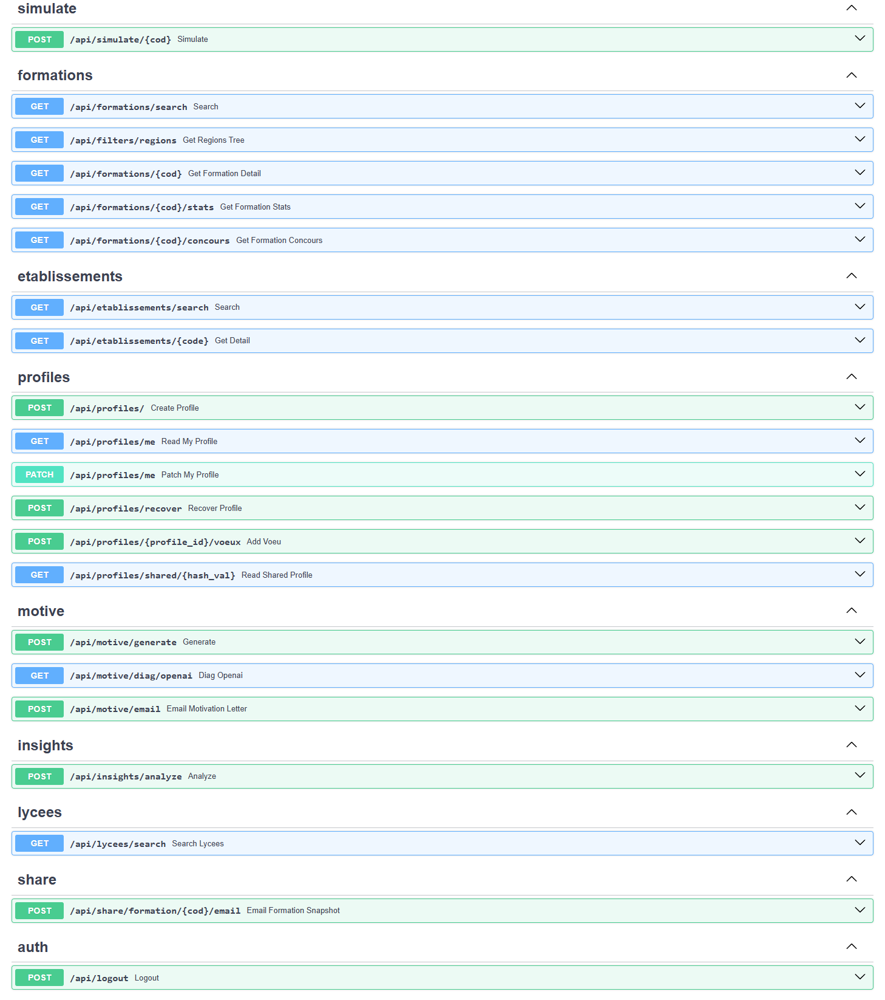
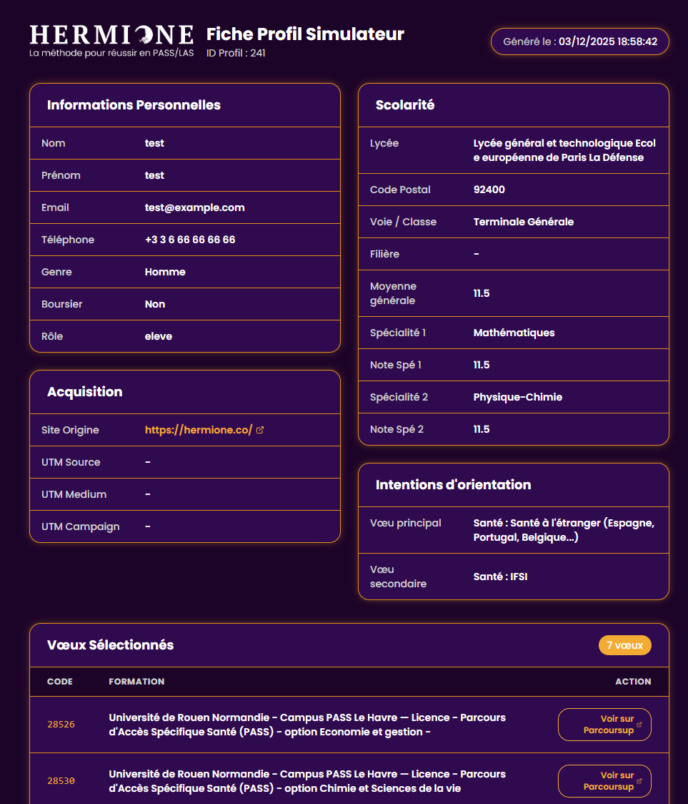

---
title: "Simulateur Parcoursup"
description: "Outil d'estimation des chances d'admission sur Parcoursup, basé sur les données ouvertes et une modélisation statistique explicable. L'application combine une API FastAPI et une interface React pour offrir une expérience interactive et transparente."
cardDescription: "Estimer ses chances d'admission Parcoursup grâce aux données ouvertes."
tags: ["Web", "Data Science", "Simulation"]
cover: "../../../assets/images/projects/simulateur-parcoursup/cover.svg"
lang: fr
draft: false
teamSize: 1
year: 2025
month: 10
repoPrivate: true
liveUrl: "https://prepa-prevision.fr/simulateur-parcoursup/"
impact:
  - value: "50k+"
    label: "lignes de code maintenues et déployées"
  - value: "10k+"
    label: "leads générés"
  - value: "200k+"
    label: "simulations effectuées"
  - value: "60k+"
    label: "vœux réalisés sur la plateforme"
  - value: "Top 1"
    label: "résultat SEO sur le mot-clé principal"
  - value: "50%"
    label: "des leads acquis via le référencement naturel"
  - value: "250"
    label: "lettres de motivation générées automatiquement"
summary: "Candidater sur Parcoursup, c'est un peu une boîte noire : on envoie ses notes et on attend. Ce simulateur prend le profil d'un élève (notes, spécialités, lycée) et estime ses chances d'admission pour n'importe quelle formation, à partir des données ouvertes du ministère et de statistiques explicables. Plus de 200 000 simulations ont été réalisées sur la plateforme."
conclusion: |
  La solution combine open data, enrichissements contrôlés et modélisation explicable. L'architecture modulaire (FastAPI/React) facilite la maintenance, l'extension et le recalibrage local. Les limites tiennent à la granularité des données agrégées et aux hypothèses distributionnelles ; elles sont compensées par des bornes explicites, un facteur principal et des seuils documentés.
appendix:
  documents:
    - title: "Article scientifique"
      description: "Article au format LaTeX décrivant la modélisation"
      url: "/images/projects/simulateur-parcoursup/article_scientifique.pdf"
      type: pdf
  structure:
    description: "Environ 50k lignes de code maintenues et organisées"
    tree: |
      backend
      ├───core
      ├───data
      │   ├───processed_data
      │   ├───processing_data
      │   └───raw_data
      ├───db
      ├───models
      ├───routers
      ├───services
      └───templates
      frontend/src
      │   App.jsx
      │   main.js
      ├───api
      ├───assets
      ├───components
      │   ├───compare
      │   ├───details
      │   ├───motivation
      │   ├───registration
      │   └───search
      ├───constants
      ├───context
      ├───pages
      ├───styles
      └───utils
  sources:
    - authors: "Ministère chargé de l'Enseignement supérieur et de la Recherche"
      year: 2024
      title: "Parcoursup 2024 — vœux de poursuite d'études et de réorientation & réponses des établissements"
      publisher: "data.enseignementsup-recherche.gouv.fr"
      url: "https://data.enseignementsup-recherche.gouv.fr/explore/dataset/fr-esr-parcoursup/"
    - authors: "Parcoursup"
      year: 2024
      title: "Quelles formations sont accessibles sur Parcoursup ?"
      publisher: "Parcoursup"
      url: "https://www.parcoursup.gouv.fr/trouver-une-formation/quelles-formations-sont-accessibles-sur-parcoursup-1318"
    - authors: "L'Étudiant"
      year: 2024
      title: "Site d'information sur l'orientation, les études et les métiers"
      publisher: "L'Étudiant"
      url: "https://www.letudiant.fr/"
---

## 1. Collecte des données

### a) Sources et fichiers d’entrée

- **Open data Parcoursup – statistiques** : `fr-esr-parcoursup.csv`
  Effectifs, mentions, rang du dernier appelé, répartition par bac, boursiers, etc.
- **Cartographie des formations** : `fr-esr-cartographie_formations_parcoursup.csv`
  Métadonnées (type d’établissement, apprentissage, internat, géolocalisation, liens).
- **Spécialités (bacheliers généraux)** : `fr-esr-parcoursup-enseignements-de-specialite-bacheliers-generaux.csv`
  Doublettes de spécialités et effectifs admis.
- **Compléments géo** : `departements-france.csv`
  Normalisation des codes départements.

> Les champs de géolocalisation sont conservés à des fins d’affichage/diagnostic, sans effet direct dans le modèle (hors agrégations académiques).

### b) Enrichissements par scraping

- **Fiches Parcoursup (formations)**
  Récupération : présentation, _attendus_ (en % quand disponible), répartition bac, jalons (candidats/admissibles/admis), conseils, détection `concours`.
- **Consolidation “concours”**
  Étiquetage `concours_label` et, si disponibles, coefficients `coeff_dossier/coeff_concours`.
- **Fiches lycées (L’Étudiant)**
  Cinq métriques « chiffres-clés » (réussite, mentions, nb d’élèves, effectif terminale, note/20) avec stratégies anti-blocage (retries, throttling, UA rotation).

## 2. Traitement des données

> But : produire des tables “modèle-prêtes” via alignements de schémas, typages, imputations et indicateurs dérivés.

### a) Nettoyage et fusion — _Formations_

1. **Indicateurs dérivés**
   - Moyenne par mentions (pondérations 11/13/15/17/19).
   - Distance à l’échelle [8, 20] et **dispersion proxy** (depuis la distribution des mentions).
   - Biais genre $B_f$ et boursiers $B_b$, bornés/normalisés.
   - **Sélectivité** $S = 1 - R_d/N$ dans $[0,1]$ (avec comblement si besoin).
2. **Cartographie 2025 & géo**

   Normalisations (apprentissage → booléen, internat catégorisé, types), renommages, complétion des départements et villes, jointure avec table des départements.

3. **Harmonisation familles de formation**

   Mapping exhaustif `formation_type → formation` (ex. « Licence sélective » → « Licence – STS »), contrôles de couverture.

4. **Ajout “concours”**

   Ajout de `concours` et `coeff_dossier`, `coeff_concours` à partir de formations présentes dans certains concours (_Sésame, Accès, Geipi-Polytech, Avenir, Advance, Puissance Alpha, IEP-Sciences Po_).

### b) Spécialités

1. **Open data**

   Filtrage par millésime, couples (doublettes) → IDs stables (1..13), calcul de `part_spe_admis` par formation, _ranking_ intra-formation.

2. **Scraping**

   Colonnes `combination` → `doublette_i` au format `id1,id2` (via `specialite2id`).

### c) Lycées

1. **Scraping robuste**

   Enrichissement incrémental, typages, anti-blocage.

2. **Feature engineering & multiplicateur**

   Décimaux (réussite, mentions), métrique $x \in [0,1]$, indicateur `infos`.

   Transformation bornée en $M_{lycee} \in [0.85, 1.15]$ via z-score → CDF → exponentielle ; si `infos=0` alors $M_{lycee} = 1.0$.

   

   Figure 1 : Pipeline de traitement des données

## 3. Établissement des métriques

> Idée : convertir chaque facteur en multiplicateur $M_i$ centré en 1, borné pour éviter les extrêmes, puis agréger.

- **Démographie (bornée, symétrique)**

  $$
  M_{\text{sexe}} = \exp\!\big(k_{\max}\,(2B_f - 1)\cdot s\big)
  $$

  $$
  M_{\text{bourse}} = \exp\!\big(k_{\max}\,(2B_b - 1)\cdot t\big)
  $$

  avec $B_f, B_b \in [0,1]$, $s,t \in \{-1,+1\}$, $k_{\max}=\ln(1.025)$ (~±2,5 %).

- **Notes générales (calibrées à la cohorte)**

  Soit $g$ la moyenne du candidat, $\mu,\sigma$ celles de la formation (depuis les mentions).

  $z=\dfrac{g-\mu}{\sigma}, p=\Phi(z)$.

  $$
  M_{\text{notes}}=\begin{cases}
  \exp\!\big(1.25\,\ln(m_{\max})(2p-1)\big) & \text{si } g<\mu \\
  \exp\!\big(\ln(m_{\max})(2p-1)\big) & \text{sinon}
  \end{cases}
  $$

  avec $m_{\max}=1.5$

- **Notes de spécialités (cohérence)**

  $n=\dfrac{(s_1+s_2)/2 - \mu}{5}$ tronqué à $[-1,1]$.

  $$
  M_{\text{notes-spe}}=\begin{cases}
  \exp\!\big(2.5\,\ln(1.5)\,n\big) & \text{si } n<0 \\
  \exp\!\big(\ln(1.5)\,n\big) & \text{sinon}
  \end{cases}
  $$

- **Type de bac (représentativité)**

  Pour bacs non généraux : plancher $m_{\min}=0.6$ selon la part observée $p_b$.

  $$
  M_{\text{bac}}=\begin{cases}
  0 & \text{si } p_b \le 0 \\
  \min\big(\max(3p_b, m_{\min}), 1\big) & \text{sinon}
  \end{cases}
  $$

- **Doublette de spécialités (adéquation/rareté)**

  Avec $p_{\text{spe}}$ la part d’admis portant la doublette et $\bar p_{\text{top}}$ la moyenne des $N$ doublettes les plus fréquentes (souvent $N=3$), poser $r=\min\!\big(p_{\text{spe}}/\bar p_{\text{top}},\,1\big)$.

  $$
  M_{\text{doublette}}=\begin{cases}
  \exp\!\big(2\,\ln(1.15)(2r-1)\big) & \text{si } r<0.5 \\
  \exp\!\big(\ln(1.15)(2r-1)\big) & \text{sinon}
  \end{cases}
  $$

- **Lycée d’origine (contexte académique)**

  Score agrégé $x \in [0,1]$ → $z=\dfrac{x-\mu_x}{\sigma_x}$, $p=\Phi(z)$.

  $$
  M_{\text{lycee}}=\operatorname{clamp}\!\big(\exp(k(2p-1)),\, m_{\min},\, m_{\max}\big)
  $$

  avec $\mu_x=0.548$, $\sigma_x=0.182$, $m_{\min}=0.85$, $k=\ln(m_{\max})$.

  Si `infos=0` alors $M_{\text{lycee}}=1$.

## 4. Modélisation choisie

### a) Score agrégé

Le score global pour une formation $f$ est :

$$
M = M_{\text{sexe}} \cdot M_{\text{bourse}} \cdot M_{\text{bac}} \cdot M_{\text{notes}} \cdot M_{\text{notes-spe}} \cdot M_{\text{doublette}} \cdot M_{\text{lycee}}
$$

> Tous les $M_i$ sont plafonnés (bornes) pour rester stables et interprétables.

### b) Conversion en percentile calibré

On suppose $M$ centré autour de 1 et on choisit $\sigma_M$ tel que le 97,5e centile corresponde à :

$\sigma_M=\dfrac{M_{\max}-1}{\Phi^{-1}(0.975)}$, $z_M=\dfrac{M-1}{\sigma_M}$, $P=\Phi(z_M)\in[0,1]$.

La valeur affichée est $100\times P$.

### c) Décision à trois niveaux

- **Refusé** si $100P<20$
- **En attente** si $20\le 100P<50$
- **Accepté** si $100P\ge 50$

> Seuils simples et ajustables par formation/millésime pour affiner la calibration locale.

### d) Explicabilité

Outre $P$, le service retourne le **facteur principal** (composante $M_i$ dominante) afin d’expliquer le résultat (notes, doublette, type de bac, lycée, etc.). Les effets démographiques sont **bornés et symétriques**.

### e) Cas “concours” (optionnel)

Si `concours = 1`, une pondération **post-dossier** est appliquée à partir d’une note de concours utilisateur et coefficients `coeff_dossier/coeff_concours` (quand disponibles).

> Exemple : $M \simeq 1.440 \Rightarrow 100P \simeq 71.8$ → Accepté.

## 5. Architecture backend

- **Framework** : FastAPI (`main.py`)
  Config via `core/config.py`, middlewares (CORS, `UserIdMiddleware`), dépendances `core/deps.py`.
- **Infrastructure de Recherche** : Intégration de **Typesense**, un moteur de recherche tolérant aux fautes de frappe et rapide, pour l'indexation et l'interrogation instantanée des formations et établissements.
- **Routeurs** :
  - `routers/simulate.py` : API de simulation (modèle `Profil`, appel `compute_admission`).
  - `routers/formations.py` : recherche & stats formations (BM25, filtres géo, distributions).
  - `routers/profiles.py` : CRUD profils (`Profile`, `Voeu`).
  - `routers/motive.py` : génération et envoi de lettres (API OpenAI + Brevo).
  - `routers/lycees.py` : recherche de lycées (pondérations département/type).
  - `routers/share.py` : envoi des résultats par mail (rendu HTML, Brevo).
- **Base & ORM** : `db/database.py` (SQLAlchemy / SQLite), `models/profile.py`.

Figure 2 : Documentation des endpoints de l’API

## 6. Points d’attention backend

- **Mailing** : `/share/simulation` → rendu HTML via `_render_motive_body_html`, envoi via Brevo (clés dans `.env.local` : `BREVO_API_KEY`, `BREVO_EMAIL_SENDER`).
- **Lettre de motivation** : `/motive/generate` (génération), `/motive/email` (envoi).
- **Moteur de Recherche** : Migration vers **Typesense** permettant la gestion des synonymes, la tolérance aux fautes de frappe et un tri pertinent des résultats.
- **Filtrage académique** : `frontend/constants/acad_map.json` (département → académie/territoire).

## 7. Architecture frontend

- **Stack** : React (Vite). Entrée `main.jsx`, app `App.jsx`.
- **Fonctionnalités avancées** :
  - **Thématisation dynamique** : Système intelligent détectant l'URL d'origine pour adapter automatiquement le **branding** (logo, palette de couleurs, liens) et permettre un déploiement multi-site en marque blanche.
  - **Partage et profils publics** : Création de pages de profil publiques accessibles via URL unique, permettant aux vendeurs d’accéder facilement aux simulations et listes de vœux des élèves.
  - **Comparateur de formations** : Outil interactif permettant de comparer côte à côte plusieurs formations sur des critères clés (sélectivité, débouchés, attendus).

Figure 3 : Fiche profil accessible

Figure 4 : Comparateur de formations

- **Dossiers clés** :
  - `api/api.js` : appels aux endpoints (simulation, formations, profiles, motive, etc.).
  - `components/` : `details/`, `motivation/`, `registration/`, `search/`.
  - `constants/` : `complete_form.json`, `concours.json`, `confidence_levels.json`, `factorExplains.js`, `tresholds.js`.
  - `context/` : état global, thème (`styles/theme.css`, `utils/ThemeLogo.jsx`).
  - `pages/` : accueil, formations, simulateur, profil, lettre.
  - `utils/` : pagination, conversions, helpers.

Figure 5 : Interface graphique de la page de recherche

## 8. Mise en ligne

### a) Hébergement Railway

Hébergement complet du backend et frontend avec une base de données **PostgreSQL** connectés et instance **Typesense** (Docker).

Figure 6 : Infrastructure Railway

### b) Automatisation n8n

- **Déclencheur** : Planifié (Schedule Trigger) pour une exécution périodique.
- **Processus** : Synchronisation quotidienne des données (Profils et Vœux) depuis la base de données vers des Google Sheets segmentés par client.
- **Finalité** : Alimentation automatique des données de suivi et déclenchement de sous-workflows pour la mise à jour des tableaux de bord (Dashboards).

Figure 7 : Workflow automatisation n8n
